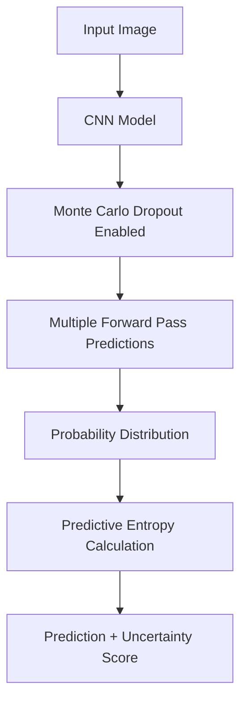

# Uncertainty Estimation in CNN-Based Traffic Sign Classification


This project implements **uncertainty estimation for image classification using Monte Carlo Dropout**.
A Convolutional Neural Network (CNN) is trained on the **German Traffic Sign Recognition Benchmark (GTSRB)** dataset to classify traffic signs. To measure prediction reliability, the system performs **multiple stochastic forward passes using Monte Carlo Dropout** and calculates **predictive entropy**.

The project includes a **FastAPI backend for model inference** and a **React frontend** that allows users to upload traffic sign images and view predictions along with model uncertainty.

---

## Features

* CNN-based traffic sign classification
* Uncertainty estimation using **Monte Carlo Dropout**
* Predictive entropy calculation for uncertainty measurement
* Image upload interface through a web UI
* FastAPI backend for model inference
* React frontend for displaying predictions and uncertainty
* Separation of backend inference and frontend visualization

---

## Uncertainty Estimation Workflow



Instead of a single prediction, the model performs **multiple forward passes with dropout enabled**, producing a distribution of predictions.
The **predictive entropy** of this distribution represents the model’s uncertainty.

---

## Installation

Clone the repository

```
git clone https://github.com/YOUR_USERNAME/cnn-uncertainty-estimation.git
```

Navigate to backend

```
cd backend
```

Install backend dependencies

```
pip install -r requirements.txt
```

Run FastAPI server

```
uvicorn main:app --reload
```

Run the frontend

```
cd frontend
npm install
npm run dev
```

---

## Dataset

This project uses the **German Traffic Sign Recognition Benchmark (GTSRB)** dataset.

* 43 traffic sign classes
* Over 50,000 labeled images

Dataset link:
https://benchmark.ini.rub.de/gtsrb_news.html

---

## Results

The system outputs:

* Predicted traffic sign class
* Prediction confidence
* Predictive entropy (uncertainty score)

Interpretation:

* **Low entropy → high confidence prediction**
* **High entropy → model is uncertain**

---

## Tech Stack

### Backend

* Python
* FastAPI
* PyTorch

### Frontend

* React
* Vite
* Tailwind CSS

### Libraries

* NumPy
* Pillow
* Torchvision

---

## Future Improvements

* Deploy model as a cloud API
* Compare with Bayesian Neural Networks
* Support additional datasets

---

## Author

Akanksha Nadipalli  
B.Tech Student  

Mini Project – Uncertainty Estimation in CNN-Based Traffic Sign Classification  
